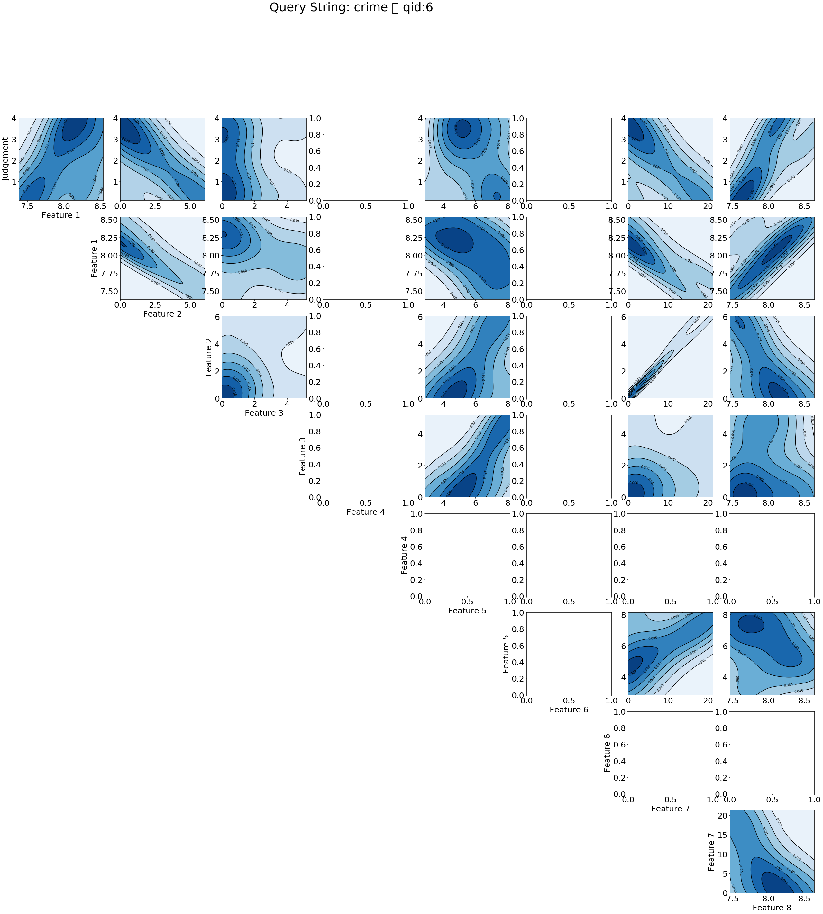

(This document is a work in progress.)
=====================================
In this section, we detail the machine learning algorithms deployed to learn what makes a search hit relevant.

We use the Elasticsearch [learning to rank](https://github.com/o19s/elasticsearch-learning-to-rank) plugin, which is distributed under Apache License 2.0.

Below, we show kernel density estimates of the Probability distribution functions (PDFs) for user judgement and each feature for an example feature/training set. This plot can be used to check how well a given training set maps onto the user perceived judgement, and therefore should be a good indicator of how well our models perform in production. The ipython notebook used to produce this plot can be found [here](https://github.com/sully90/dp-search-service/blob/master/src/main/python/Training%20Data%20Analysis.ipynb). Note, features 4 and 6 are not triggered for this particular query (not true generally), hence these panels are left blank intentionally.

# References
* [1] C.J.C. Burges, T. Shaked, E. Renshaw, A. Lazier, M. Deeds, N. Hamilton and G. Hullender. Learning to rank using gradient descent. In Proc. of ICML, pages 89-96, 2005.
* [2] Y. Freund, R. Iyer, R. Schapire, and Y. Singer. An efficient boosting algorithm for combining preferences. The Journal of Machine Learning Research, 4: 933-969, 2003.
* [3] J. Xu and H. Li. AdaRank: a boosting algorithm for information retrieval. In Proc. of SIGIR, pages 391-398, 2007.
* [4] D. Metzler and W.B. Croft. Linear feature-based models for information retrieval. Information Retrieval, 10(3): 257-274, 2007.
* [5] Q. Wu, C.J.C. Burges, K. Svore and J. Gao. Adapting Boosting for Information Retrieval Measures. Journal of Information Retrieval, 2007.
* [6] J.H. Friedman. Greedy function approximation: A gradient boosting machine. Technical Report, IMS Reitz Lecture, Stanford, 1999; see also Annals of Statistics, 2001.
* [7] Z. Cao, T. Qin, T.Y. Liu, M. Tsai and H. Li. Learning to Rank: From Pairwise Approach to Listwise Approach. ICML 2007. 
* [8] L. Breiman. Random Forests. Machine Learning 45 (1): 5–32, 2001.